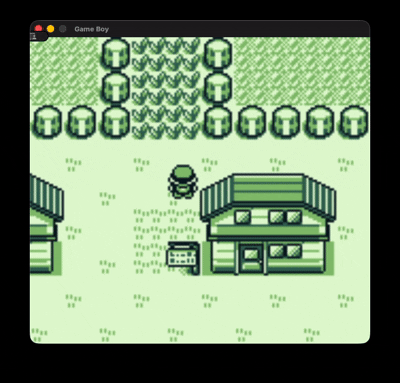

# zig-gameboy

A Game Boy emulator written in Zig.

  

## Features

- Full Sharp LR35902 instruction set
- All memory structures and registers, apart from ALU, CGB and Serial Transfer
- Currently supports 4 GameBoy cartridge types with automatic detection
- Full PPU using scanline rendering with DMG colour palettes
- Various components such as the Timer, Interrupt Controller, and Joypad
- SDL3 GUI using Zig's C interoperability, implementing rendering and ROM selection
- Working save games
- Toggleable emulation speeds

## Usage

### Build & run

```
zig build run
```
### Controls

| Game Boy | Keyboard    |
|----------|-------------|
| D-Pad    | Arrow Keys  |
| A        | Z           |
| B        | X           |
| Start    | Enter       |
| Select   | Right Shift |

| Emulator      | Keyboard |
|----------------|----------|
| Toggle Speed   | S        |


## Planned features

- CMG Graphics
- Audio Processing Unit
- Save states
- Additional MBCs

## Test Roms
- Passes Blargg cpu instructions and instruction timing tests
